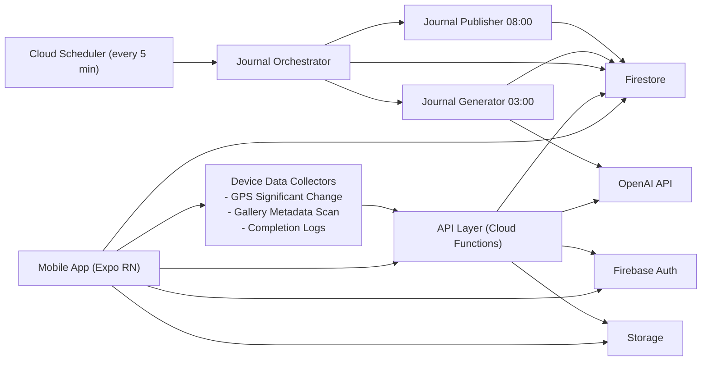

# Planner MVP 아키텍처 설계안 + 검수

- 버전: v1.1
- 작성일: 2026-02-17
- 대상 범위: 로그인/OAuth/계정복구, 채팅, 캘린더, 일지, 설정

## 1. 목표와 범위

### 1.1 목표
1. 여행 플랜을 채팅으로 생성/수정하고, 캘린더와 일지로 실행/회고를 완결한다.
2. 일지는 일정/GPS/갤러리 메타데이터 기반으로 자동 생성한다.
3. 자동 생성은 플랜 현지시간 03:00 생성, 08:00 공개를 강제 보장한다.

### 1.2 비목표(문서 전역 제외)
1. 다기기 동기화 기획
2. 수동 편집 보호(lock) 기획
3. 되돌리기 기능
4. BM/개인정보/KPI 섹션

## 2. 제품 구조(UX/화면 계층)

### 2.1 전역 내비게이션
1. 하단 탭: `채팅` / `캘린더` / `일지`
2. 사이드바: `채팅 화면에서만` 노출
3. 사이드바 기능: 플랜 전환/추가, 설정, 휴지통
4. 캘린더/일지에는 사이드바 없음

### 2.2 1뎁스 화면
1. 로그인/OAuth/계정복구
2. 채팅
3. 캘린더
4. 일지
5. 설정

## 3. 시스템 아키텍처

### 3.1 핵심 설계 원칙
1. 서버 기준 배치로 03:00/08:00 실행을 강제한다.
2. 승인형 반영 원칙: AI 제안은 `등록/수정/취소` 전 저장 금지.
3. 일지 생성은 상태/우선순위 규칙으로 일자당 핵심 5개 이벤트만 사용한다.
4. 이미지는 가능한 많이 활용하되, 없으면 빈값 허용한다.

## 4. 화면별 기능-아키텍처 매핑

## 4.1 로그인/OAuth/계정복구

### 화면 기능
1. Google/Kakao 로그인
2. OAuth 실패/취소 처리
3. 계정복구 안내(공급자 경로)

### 아키텍처 구성
1. 클라이언트: `expo-auth-session`
2. 서버: Kakao code 교환 함수, Firebase Custom Token 발급
3. 데이터: `users/{uid}` 최소 프로필 생성

### 주요 API
1. `POST /auth/kakao/exchange`
2. `POST /auth/session/bootstrap`

## 4.2 채팅

### 화면 기능
1. 플랜 리스트(최신 수정순)
2. 플랜 생성(제목/기간/목적지)
3. 채팅 입력 + 이미지(OCR)
4. AI 변경안 카드(등록/수정/취소)
5. 삭제 확인팝업 후 휴지통 이동

### 아키텍처 구성
1. 앱: 채팅 뷰 + 승인카드 렌더러 + 사이드바
2. 서버: 제안 생성 함수, OCR 파서, 신규/수정 자동 판단
3. DB: `plans`, `plans/{planId}/events`, `plans/{planId}/messages`, `plans/{planId}/changeProposals`, `trash`

### 규칙 반영
1. OCR은 인식값 그대로 초안 반영
2. 단일 수정은 묶음 승인만 허용
3. 다중 생성은 일괄버튼 + 이벤트별 override 허용

## 4.3 캘린더

### 화면 기능
1. 모드 전환: 전체일정 / 개별일정
2. 개별일정은 이벤트 블록 적층 최대 3개
3. 4개 이상 `+N` 표시
4. 날짜 선택 시 하단 패널에서 전체 이벤트/메모 노출

### 아키텍처 구성
1. 앱: 캘린더 월 뷰 + 하단 패널
2. DB: 일자별 이벤트 쿼리 최적화 인덱스
3. 색상 정책: 8팔레트 랜덤 기본 부여 + 사용자 수정 허용

## 4.4 일지

### 화면 기능
1. 하루 1개 자동 일지 생성
2. 일정별 모아보기(플랜 단위)
3. 유형별 모아보기(숙소/음식/즐길거리/교통/쇼핑/기타)
4. 텍스트/사진 수정, 항목 삭제, 수동 추가

### 아키텍처 구성
1. 앱: 일지 홈, 모아보기, 상세, 편집 화면
2. 서버 배치: 등록 백필 + 일일 생성 + 일일 공개
3. 데이터 수집: 일정 상태, 완료체크, GPS, 갤러리 메타데이터

### 자동 생성 정책
1. 대상 상태: `확정/완료/빈값` 포함, `임시` 제외
2. 중요도 기반 핵심 이벤트 최대 5개 선정
3. 중요하지 않은 이벤트는 미선정 가능
4. 사진 매칭 실패 시 이미지 빈값 허용
5. 데이터 부족이고 생성 설정 ON이면 계획 기반 생성
6. 그래도 불가하면 고정 문구 표시: `정보가 부족해 일지를 만들지 못 했어요`

### 권한 거부 UX
1. 문구: `갤러리에 접근해야 일지를 만들 수 있어요`
2. 버튼: `갤러리 권한 승인하기`
3. 버튼 동작: OS 설정 화면 이동

## 4.5 설정

### 화면 기능
1. 계정 정보, 로그아웃
2. 권한 상태 확인/이동
3. 일지 옵션(`데이터가 없어도 생성`)
4. 휴지통(30일)

### 아키텍처 구성
1. 앱: 설정 섹션 페이지
2. DB: `settings/{uid}`
3. 배치: 30일 경과 휴지통 정리

## 5. 데이터 모델(요약)

## 5.1 주요 컬렉션
1. `users/{uid}`
2. `plans/{planId}`
3. `plans/{planId}/events/{eventId}`
4. `plans/{planId}/dayMemos/{dayMemoId}`
5. `plans/{planId}/messages/{messageId}`
6. `plans/{planId}/changeProposals/{proposalId}`
7. `plans/{planId}/journalDays/{journalDayId}`
8. `plans/{planId}/journalEntries/{entryId}`
9. `plans/{planId}/photoCandidates/{photoId}`
10. `journalJobs/{jobId}`
11. `trash/{trashId}`

## 5.2 핵심 필드
1. Plan: `title`, `destination`, `startDate`, `endDate`, `planTimezone`, `isForeign`, `journalEnabledAt`
2. Event: `status`, `category`, `date`, `startTime`, `endTime`, `memo`, `colorId`
3. TravelLeg: `departAtLocal`, `departTz`, `arriveAtLocal`, `arriveTz`
4. Message: `role(user|assistant|system)`, `text`, `images[]`, `linkedProposalId`, `createdAt`
5. ChangeProposal: `proposalType`, `approvalState`, `bundleId`, `operations[]`, `requestedAt`
6. JournalDay: `date`, `state(draft|published|failed)`, `publishAtLocal0800`, `summary`
7. JournalEntry: `type`, `importanceScore`, `text`, `images[]`, `sources[]`
8. JournalJob: `phase`, `dueAtUtc`, `state`, `attemptCount`, `idempotencyKey`

## 5.3 공통 메타 필드(스키마 보완)
1. 적용 대상: `plans`, `events`, `messages`, `changeProposals`, `dayMemos`, `journalDays`, `journalEntries`, `photoCandidates`, `trash`
2. 필수 필드: `ownerUid`, `createdAt`, `updatedAt`, `schemaVersion`
3. 변경 추적: `createdBy(user|system)`, `updatedBy(user|system)`, `source(chat|ocr|calendar|journal|batch)`
4. 소프트 삭제: `isDeleted(default:false)`, `deletedAt`, `deletedBy`
5. 동시성 제어: `version`(낙관적 락용 증가값)

## 5.4 데이터 불변조건(스키마 전제)
1. 여행 1건은 플랜 1개이며, 하위 엔터티는 반드시 단일 `planId`에 소속된다.
2. `events.ownerUid`는 상위 `plans.ownerUid`와 동일해야 한다.
3. `status`는 `temporary|confirmed|completed|null`만 허용한다.
4. `category`는 `transport|stay|todo|shopping|food|etc|null`만 허용한다.
5. 시간 필드는 선택값이며, `startTime`과 `endTime`이 모두 있으면 `endTime >= startTime`이어야 한다.
6. 교통 이벤트는 `departTz`와 `arriveTz`를 반드시 가진다.
7. `journalDays`는 `planId + dateLocal` 조합으로 1개만 존재한다.
8. 자동 생성 엔트리는 1일 최대 5개까지만 생성 가능하다.

## 5.5 승인형 변경 제안 엔터티(신규)
1. 컬렉션: `plans/{planId}/changeProposals/{proposalId}`
2. 핵심 필드: `proposalType(create|update|delete)`, `approvalState(pending|approved|rejected|expired)`, `bundleId`, `operations[]`
3. 비교 필드: `snapshotBefore`, `snapshotAfter`
4. 시점 필드: `requestedAt`, `approvedAt`, `rejectedAt`, `expiresAt`
5. 적용 규칙: `approvalState=approved`일 때만 실제 `events/dayMemos/plans` 변경 반영

## 6. 일지 배치 설계(강제 실행)

## 6.1 오케스트레이션
1. Cloud Scheduler는 5분 주기로 `journalJobs` 러너를 호출
2. 러너는 `dueAtUtc <= now`이고 `state in (queued, failed)`인 작업만 조회한다
3. 조회 후 락을 선점한 작업만 실행(`running -> done/failed`)
4. 생성/공개 시각 계산은 enqueue 시점에 `planTimezone` 기준으로 `dueAtUtc`를 확정한다
5. 시각 변환 계약(2단계 잠금):
   - `phase=generate|backfill`: `dateLocal`의 현지 `03:00`
   - `phase=publish`: `dateLocal`의 현지 `08:00`
   - 변환은 IANA timezone + DST 기준으로 수행(고정 UTC 시각 매핑 금지)
6. 런타임에서 전체 플랜 스캔은 금지하며, `journalJobs`를 단일 소스오브트루스로 사용한다

## 6.2 백필(과거 일괄 생성)
1. 일지 등록 시 `journalEnabledAt` 저장
2. 일정이 이미 시작된 경우 시작일~등록 전날 범위를 `journalJobs`로 분할 enqueue
3. 실패 배치는 재시도 큐로 이동

## 6.3 배치 작업 엔터티(스키마 보완)
1. 컬렉션: `journalJobs/{jobId}`
2. 핵심 필드: `planId`, `dateLocal`, `phase(generate|publish|backfill)`, `dueAtUtc`, `timezone`
3. 실행 필드: `state(queued|running|done|failed|deadletter)`, `attemptCount`, `lastError`
4. 멱등 필드: `idempotencyKey(planId+dateLocal+phase)`, `lockOwner`, `lockAt`
5. 운영 필드: `createdAt`, `updatedAt`, `nextRetryAt`
6. 운영 원칙: 모든 자동 일지 작업은 `journalJobs`를 통해서만 실행한다

## 7. GPS/갤러리 데이터 수집

## 7.1 GPS
1. 배터리 절감을 위해 significant-change 방식 사용
2. 앱은 포인트를 로컬 큐에 저장 후 온라인 시 업로드

## 7.2 갤러리
1. 메타데이터(촬영시각, 위치, 로컬 ID) 스캔
2. 일지 후보로 사용할 저해상 썸네일 업로드(권한 허용 시 기본 ON)
3. 원본은 필요 시에만 업로드

## 7.3 오프라인 수동입력 동기화
1. 이벤트/메모/승인 동작은 앱 로컬 `Outbox`에 먼저 기록한다
2. 온라인 복귀 시 Outbox 작업을 Functions API로 순차 전송한다
3. 서버 반영 성공 시 로컬 항목을 확정 처리하고 실패 항목은 재시도 큐로 유지한다
4. 권한 거부 상태여도 채팅/캘린더/수동 일지 입력은 Outbox 경로로 계속 사용 가능해야 한다

## 8. 운영/비기능 요구사항

1. 가용성: 배치 실패 시 자동 재시도(최소 3회)
2. 성능: 캘린더 월 조회 P95 500ms 이내
3. 생성 시간: 일지 1건 생성 10초 이내(평균)
4. 로그: 배치/AI/OCR 실패 로그 필수
5. 비용 제어: AI 호출은 생성 시점으로 제한

## 9. 배포/환경

1. 앱: Expo(EAS Build)
2. 백엔드: Firebase Functions + Firestore + Storage + Scheduler
3. 필수 런타임: Node 24, JDK21+, Android SDK, CocoaPods, Xcode(수동 설치)

## 10. 아키텍처 검수 결과

## 10.1 검수 체크리스트
1. 요구사항 정합성(화면/기능/정책)
2. 03:00/08:00 강제 실행 가능성
3. 데이터 모델 완결성
4. 실패/재시도/멱등성
5. UX 문구/권한 흐름 정합성

## 10.2 결과 요약
1. `PARTIAL`: 화면 구조, 상태 규칙, 캘린더/일지 정책은 문서/백엔드 기준 반영. 모바일 UI 구현은 별도 진행 필요
2. `PARTIAL`: 강제 스케줄(due queue, lock, 재시도) 최소 구현 완료. 타임존 정밀 변환 `계약`은 확정했으며 코드 반영은 단계4에서 진행
3. `PASS`: 권한 거부 문구/CTA 기획 반영 완료
4. `REVIEW NEEDED`: 사진 매칭 품질 기준(시간/거리 임계값) 수치 확정 필요
5. `REVIEW NEEDED`: 일지 “충분히 채워짐” 임계값(예: 상위 3개 이후 컷오프 점수) 운영값 확정 필요

## 10.3 주요 리스크와 대응
1. 리스크: 갤러리 권한 거부 시 일지 품질 저하
   - 대응: 계획 기반 생성 + 부족 문구 표기
2. 리스크: 배치 지연으로 08:00 공개 누락
   - 대응: 공개 작업 우선순위 큐 + 08:05 보정 재실행
3. 리스크: OCR 노이즈로 잘못된 초안 생성
   - 대응: 승인형 반영 유지(자동 저장 금지)

## 10.4 출시 전 기술 검증 항목
1. 플랜 타임존별 03:00/08:00 동작 시뮬레이션
2. 백필 대량 생성(최소 14일) 부하 테스트
3. 사진 0장/5장/50장 시 생성 품질 검증
4. 교통 이벤트 출발/도착 이중 타임존 표기 검증

## 11. UX/기획의도 관점 아키텍처 검수

### 11.1 점검 프레임
1. 첫 화면 즉시성: 앱 실행 시 계획을 즉시 볼 수 있는지
2. 한눈 파악성: 캘린더/일지에서 핵심 정보가 누락 없이 보이는지
3. 대화형 신뢰성: AI 제안이 사용자가 통제 가능한 형태로 반영되는지
4. 실행 연계성: 계획 작성 → 일정 확인 → 완료 체크 → 일지 생성 흐름이 닫히는지
5. 인지 부하: 필수 동선이 최소 터치로 끝나는지

### 11.2 PASS 항목 (기획의도 부합)
1. `채팅` 중심 동선이 맞음: 기획의도인 대화형 플랜 편집 경험과 정합.
2. `계획 단위` 구조가 일관됨: 여행1건=플랜1개로 도메인 충돌이 적음.
3. 상태 단순화(`임시/확정/완료/빈값`)가 개인용 단순성 기획과 부합.
4. 승인형 반영이 설계되어 있어 정보 손실/오탐에 대한 신뢰성 리스크를 UX적으로 낮춤.
5. 휴지통 30일 보관은 실수 복구 요구를 어느 정도 반영.

### 11.3 보강 필요 이슈 (우선순위)
1. [중요] 하단 탭과 사이드바 역할 분리에 따른 전환 비용
- 채팅에서는 계획 전환이 빠르지만 캘린더/일지에서는 동일 기능이 없어 “현재 보고 있는 플랜” 전환이 번거로움.
- 제안: 모든 화면에서 현재 플랜 표시를 고정하고, 탭 이동 시에도 플랜 컨텍스트가 유지되는 규칙을 명시.

2. [중요] 랜덤 색상 정책의 장기 인지 부하
- 이벤트가 많아질수록 색상 의미성이 약해지고 사용자가 기록 추적을 놓칠 수 있음.
- 제안: 8색은 유지하되, planId + eventType 고정 해시 매핑으로 시각 일관성 확보.

3. [중요] 캘린더 3개 적층 규칙의 상세 UX 미비
- +N 표시/하단 패널은 적절하나, 1~3개 케이스의 터치 피드백·높이 규칙이 미정의.
- 제안: 블록 수량별 최소 터치면적과 시각 우선순위(상태/중요도) 규칙 명시.

4. [중요] 일지 생성 근거의 설명성 부족
- 사용자가 왜 특정 이벤트가 포함/제외되는지 판단이 어려움.
- 제안: 일지 카드에 `선정 이유 요약`(예: 중요도 상위/메모 밀도/시간 일치)을 노출.

5. [중요] 오프라인 구간 배치 처리 미정
- 오프라인에서 GPS/갤러리 수집 지연은 인정했으나, 배치 생성이 미진입했을 때의 사용자 안내·재시도 규칙이 약함.
- 제안: 동기화 미완료 시 상태 배너 + 업로드 완료 시 자동 재생성.

6. [중요] 타임존 병렬 표기의 사용자 일관성
- 여행 이벤트의 출발/도착 타임존 처리 정책이 기획상 강하나 UI 표기 규칙이 빠짐.
- 제안: 이벤트 타임스탬프는 항상 `지역시간+tz` 형식 고정.

### 11.4 기획 의도 미스매치 가능성
1. 준비·진행·회고 세 단계 사용패턴에 대한 모드 분리 부재
- 아키텍처는 한 화면에서 모두 처리하나, 실제 사용자는 동작 단계별 니즈가 다름.
- 제안: 일정 생성/확정은 `준비 모드`, 당일 완료 체크는 `진행 모드`, 여행 후 편집은 `회고 모드`로 뷰 우선순위를 다르게.

2. 휴지통 접근성
- 휴지통은 설정 영역에서만 진입하면 발견성이 낮을 수 있음.
- 제안: 설정 외 짧은 경로(캘린더/채팅 하단 영역에 휴지통 진입 포인트) 추가 고려.

### 11.5 바로 확정해야 할 항목
1. 랜덤 색상 적용 범위와 고정 규칙
2. 타임존 표시 포맷(일일 뷰/캘린더/일지 일관화)
3. 오프라인 상태에서 일지 생성 실패 시 사용자 안내 및 재시도 정책
4. 캘린더/일지에서 계획 전환 시나리오 고도화
5. 일지 자동생성 근거 표시의 범위(모든 항목 or 요약만)

## 12. 개발적 측면 아키텍처 재검수

### 12.1 재검수 프레임
1. 배포/운영 가능성: 무한 증분 데이터에서 비용과 성능이 유지되는가
2. 정확성: 타임존, 시간 계산, 중복 실행을 방지하는가
3. 일관성: 승인, 삭제, 임시 상태 전환이 단일 소스에서 통제되는가
4. 장애 허용: 배치 실패·오프라인·권한 거부 시 복구 경로가 있는가
5. 보안성: 인증/권한 경계가 클라이언트 의존으로 무너지는가

### 12.2 PASS 항목 (현재 설계 기준)
1. 채팅형 AI 제안을 `제안 저장 -> 승인 반영`으로 분리한 점은 오작동 회복성과 감사성이 높다.
2. 03:00 생성 / 08:00 공개를 배치 강제로 분리한 점은 정책 준수에 유리하다.
3. 오프라인 로컬 큐 개념을 넣어 단말 수집 손실 가능성을 감소시켰다.
4. 휴지통 임시 저장 후 삭제 정책은 데이터 삭제 위험을 줄인다.

### 12.3 개발 이슈 (자율성 기준 우선순위 재정렬)
1. [P0] 승인 없는 자동 반영 가능성  
`제안 저장 -> 승인 반영` 원칙이 존재하지만, 쓰기 경로가 분리되지 않으면 우회 저장이 가능해진다.
   - 자율성 영향: 사용자가 승인하지 않은 변경이 반영되어 신뢰를 잃는다.
   - 권고: 이벤트/플랜 변경은 `approveChange` 계열 API로만 반영하고, 클라이언트 직접 쓰기 금지.

2. [P0] 권한 거부 시 핵심 기능 차단 위험  
갤러리/GPS 권한이 없어도 플랜 관리와 수동 일지 작성은 계속 가능해야 한다.
   - 자율성 영향: 권한 미허용 사용자가 앱을 실질적으로 못 쓰게 되면 자유 사용 원칙이 깨진다.
   - 권고: 권한 거부 상태에서도 채팅/캘린더/수동 일지는 full usable, 자동 수집만 비활성화.

3. [P0] 탭 간 플랜 컨텍스트 불일치 위험  
채팅에서 플랜을 바꿨는데 캘린더/일지가 이전 플랜을 유지하면 오편집이 발생할 수 있다.
   - 자율성 영향: 사용자의 의도와 다른 플랜이 수정되어 통제권이 약해진다.
   - 권고: `activePlanId` 전역 단일 상태를 유지하고 탭 전환 시 동일 컨텍스트를 강제.

4. [P1] 상태/시간/카테고리 입력 강제 가능성  
유효성 검증을 엄격하게 잡으면 `빈값/시간 미정` 허용 원칙이 구현에서 깨질 수 있다.
   - 자율성 영향: 사용자가 원하는 만큼만 기록하는 사용성 저하.
   - 권고: 서버 스키마에서 `status/category/time` optional 허용, default는 비강제 방식 유지.

5. [P1] 배치 스케줄 조회 패턴 비효율  
시간대별 전체 플랜 스캔 방식은 규모 확대 시 지연/비용을 키워 자동화 품질을 저하시킨다.
   - 자율성 영향: 사용자가 켠 자동 일지 기능이 약속된 시간에 동작하지 않을 수 있다.
   - 권고: `journalJob` 큐 또는 `dueAt` 인덱스 기반 실행으로 변경.

6. [P1] 멱등성 락 경합 처리 미정의  
동일 `planId+date+phase` 중복 실행 시 일지 이중 생성/공개가 발생할 수 있다.
   - 자율성 영향: 사용자가 수정한 결과와 시스템 생성본이 충돌해 통제감이 떨어진다.
   - 권고: transaction 기반 선점(`RUNNING -> DONE/FAILED`)과 실행 토큰 검증 추가.

7. [P1] 이미지 활용 목표와 업로드 정책의 불일치  
사진 활용을 강조하지만 썸네일 업로드가 옵션이면 서버 생성 품질이 크게 흔들린다.
   - 자율성 영향: 사용자가 기대한 자동화 품질이 일관되지 않다.
   - 권고: 최소 메타데이터 + 저해상 썸네일 업로드를 기본값으로 고정.

8. [P1] Firestore 인덱스/공통 필드 미정의  
`latest modified` 정렬과 범위 조회 요구 대비 `updatedAt`/인덱스 정의가 부족하다.
   - 자율성 영향: 사용자가 원하는 목록/조회 방식이 느리거나 깨질 수 있다.
   - 권고: 공통 필드(`ownerUid`,`createdAt`,`updatedAt`)와 컴포지트 인덱스를 선확정.

9. [P2] 보안/검증 경계 미고정  
클라이언트 쓰기 경계가 느슨하면 사용자 데이터 무결성이 깨진다.
   - 자율성 영향: 본인 데이터에 대한 통제권과 신뢰 저하.
   - 권고: Functions 경유 또는 Rules 소유자 검증 강제, 시스템/사용자 행위 분리.

10. [P2] 삭제/복구 경로 데이터 일관성  
휴지통 이동 후 캐시가 즉시 갱신되지 않으면 화면 간 불일치가 생긴다.
   - 자율성 영향: 사용자가 본 상태와 실제 상태가 달라 조작 실수를 유발한다.
   - 권고: `isDeleted` 소프트 삭제 + 실시간 쿼리 필터 + 캐시 무효화 정책 적용.

### 12.4 수정 권고안 (자율성 우선 MVP 최소 조합)
1. 변경 반영 게이트웨이: `approveChange` 단일 엔드포인트로 반영 경로를 통합.
2. 전역 컨텍스트: 앱 전역 `activePlanId` 저장소를 두고 탭/화면에서 공통 사용.
3. 권한 graceful degradation: 권한 거부 시 자동 수집만 중단하고 핵심 기능은 유지.
4. 비강제 입력 스키마: `status/category/time` optional + UI 기본값(확정)으로 운영.
5. 배치 안정화: `journalJobs(dueAtUtc)` + `journalRunLock` 도입.
6. 데이터 일관성: 공통 필드 + 인덱스 + 소프트 삭제 정책을 컬렉션 전역으로 통일.

### 12.5 기술 검증 항목(자율성 보장 중심으로 보강)
1. 권한 거부 상태에서 채팅/캘린더/수동 일지 작성이 모두 가능한지 E2E 검증
2. 상태/시간/카테고리 빈값 이벤트가 생성/수정/조회 전 경로에서 정상 동작하는지 검증
3. 미승인 AI 제안이 어떤 경로에서도 반영되지 않는지 보안/통합 테스트
4. 탭 전환 시 `activePlanId` 드리프트(불일치) 없는지 시나리오 테스트
5. 03:00/08:00 경계 중복 실행 시 일지 중복 생성이 차단되는지 멱등성 테스트
6. 플랜 1만 건 기준 스케줄러 비용/지연을 due 큐 방식과 비교 검증

## 13. 자율성 우선 설계 규약

### 13.1 제품 원칙
1. 앱은 사용자를 통제하지 않고 사용자가 원하는 수준으로 기록/관리하도록 돕는다.
2. 자동화는 기본적으로 제안이며, 최종 반영 권한은 사용자에게만 있다.
3. 필수 입력은 최소화하고 빈값/미정 상태를 정상 데이터로 취급한다.
4. 권한 미허용은 기능 축소 사유일 뿐, 앱 사용 차단 사유가 아니다.
5. 사용자는 언제든 수동 입력/수정/삭제로 자동화 결과를 덮어쓸 수 있다.

### 13.2 금지 규칙
1. 예약정보/상태/시간/카테고리 입력 강제 금지
2. AI 결과 자동 확정 금지
3. 갤러리/GPS 권한 미허용 시 전체 기능 차단 금지
4. 컨텍스트 불명확 상태(현재 플랜 미표시)에서 변경 실행 금지

### 13.3 아키텍처 반영 체크포인트
1. 모든 변경 API가 `actor(user|system)`와 `approvalState`를 기록하는지 확인
2. 화면 공통 헤더에 현재 플랜 컨텍스트를 표시하는지 확인
3. 권한 상태별 동작표(허용/거부/제한)를 기능별로 정의했는지 확인
4. 일지 자동 생성 실패 시 fallback(계획 기반 생성/실패문구/재시도)이 명확한지 확인
5. 휴지통 복구 후 캘린더/일지/채팅 뷰가 즉시 동기화되는지 확인

## 14. 스키마 작업 선행 설계사항 리스트

### 14.1 문서레벨 보완 결과(이번 반영)
1. 공통 메타 필드(`ownerUid`, `createdAt`, `updatedAt`, `version`)를 전 컬렉션 공통 전제로 고정했다.
2. 상태/카테고리/시간/일지 생성 수량에 대한 불변조건을 명문화했다.
3. 승인형 반영을 위한 `changeProposals` 엔터티를 추가했다.
4. 배치 안정성을 위한 `journalJobs` 엔터티와 멱등/락 필드를 추가했다.
5. 스키마 구현 전 결정해야 할 기준값을 체크리스트로 분리했다.

### 14.2 스키마 선확정 항목(2단계 잠금)
1. 타임존 우선순위 확정:
   - 교통 이벤트는 `departTz/arriveTz` 우선
   - 일반 이벤트는 `event.timezone` 우선, 없으면 `planTimezone`
   - 시간 미정 이벤트는 `dateLocal`을 절대 기준으로 사용
2. `createPlan` 멱등성 확정:
   - 클라이언트가 `opId`를 보낸 경우에만 멱등 보장
   - `opId` 미전송 요청은 비멱등 신규 생성으로 처리
   - 제목/기간/목적지 기반 deterministic fallback 금지
3. `approveChange` 보호 필드 확정:
   - 시스템 필드(`ownerUid`, `createdAt`, `schemaVersion`, `version`, 삭제 메타 등)는 patch/draftData 입력 금지
   - `targetType`별 화이트리스트 필드만 update 허용
   - 승인 반영 성공 시 대상 문서 `version +1`

### 14.3 잔여 확정 필요 항목
1. 제안 만료 정책 확정: `expiresAt` 값, 만료 후 재요청 규칙, 정리 배치 주기
2. 휴지통 복구 범위 확정: 이벤트 단독 복구 vs 메모/일지/첨부 연쇄 복구
3. 관측성 필드 확정: 배치 실패/권한 거부/동기화 지연 지표 저장 위치와 보존기간

### 14.4 스키마 산출물 정의(다음 단계)
1. Firestore 컬렉션별 필드 명세서(타입/필수/기본값/enum/검증식)
2. Firestore Security Rules 초안
3. `firestore.indexes.json` 초안
4. Cloud Functions 입출력 스펙(`approveChange`, `enqueueJournalJob`, `runJournalJob`)
5. 데이터 마이그레이션 규칙(`schemaVersion` 기반)

## 15. v1.1 정합성 잠금 결정

1. 메시지 저장 경로는 `plans/{planId}/messages/{messageId}`로 고정한다.
2. 오프라인 수동입력은 Firestore 직접 쓰기 대신 로컬 Outbox 후 Functions 동기화로 고정한다.
3. 자동 일지 스케줄의 실행 소스는 `journalJobs` 단일 경로로 고정한다.
4. Cloud Scheduler는 플랜 스캔을 수행하지 않고 due 작업 러너만 호출한다.
5. 이벤트 색상은 생성 시 8팔레트에서 기본 배정하되 사용자 수정을 허용한다.
6. 휴지통 만료 삭제는 `Asia/Seoul` 기준 매일 03:00에 1회 실행한다.
